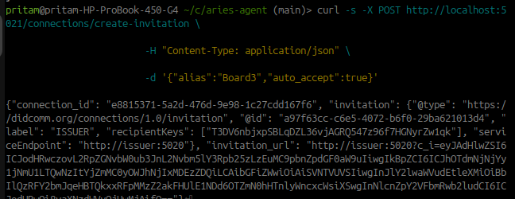
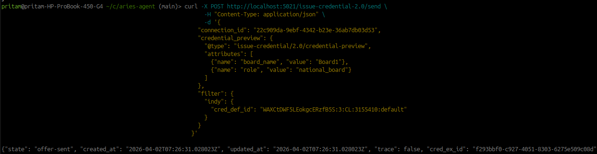
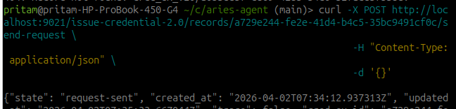

## Config files are mainly generated by fabric network setup commands
Stage 1 — Docker + Compose v2 (official repo)

sudo apt update
sudo apt install -y ca-certificates curl gnupg
sudo install -m 0755 -d /etc/apt/keyrings
curl -fsSL https://download.docker.com/linux/ubuntu/gpg | sudo tee /etc/apt/keyrings/docker.asc > /dev/null
echo "deb [arch=$(dpkg --print-architecture) signed-by=/etc/apt/keyrings/docker.asc] https://download.docker.com/linux/ubuntu $(lsb_release -cs) stable" | sudo tee /etc/apt/sources.list.d/docker.list > /dev/null
sudo apt update
sudo apt install -y docker-ce docker-ce-cli containerd.io docker-buildx-plugin docker-compose-plugin
sudo systemctl enable docker
sudo systemctl start docker
sudo usermod -aG docker $USER

Log out / log in, then:

docker --version
docker compose version

Stage 2 — Install Fabric samples + binaries + images

cd ~
git clone https://github.com/hyperledger/fabric-samples.git
cd fabric-samples
git fetch --all --tags
git checkout v2.4.9
curl -sSL https://bit.ly/2ysbOFE | bash -s
./bin/peer version

Stage 3 — Create project folders

mkdir -p ~/cricket-blockchain/{config,network,chaincode/cricket}

Stage 4 — Crypto material

cat ~/cricket-blockchain/config/crypto-config.yaml

Generate:

cd ~/cricket-blockchain
rm -rf ./config/crypto/ordererOrganizations/
rm -rf ./config/crypto/peerOrganizations/

~/fabric-samples/bin/cryptogen generate --config=config/crypto-config.yaml --output=config/crypto
# docker-compose -f docker2.yaml down -v

Stage 6 — Generate genesis + channel tx (FABRIC_CFG_PATH required)

cd ~/cricket-blokchain
export FABRIC_CFG_PATH=$PWD/config
rm -rf ./config/genesis.block
rm -rf ./config/cricketchannel.block
rm -rf ./config/cricketchannel.tx
~/fabric-samples/bin/configtxgen -profile FourOrgsOrdererGenesis -channelID system-channel -outputBlock config/genesis.block
~/fabric-samples/bin/configtxgen -profile CricketChannel -outputCreateChannelTx config/cricketchannel.tx -channelID cricketchannel

Add core.yaml (required by peer CLI):

cp ~/fabric-samples/config/core.yaml ~/cricket-blockchain/config/core.yaml

Stage 7 — Docker network (orderer TLS enabled)

nano ~/cricket-blockchain/network/docker-compose.yaml

Start:

cd ~/cricket-blokchain/network
docker-compose -f docker2.yaml up -d
docker ps

Stage 8 — Create channel (TLS) + join peers
Enter CLI:

docker exec -it cli.board1 bash

Channel create:

cd /etc/hyperledger/config

export FABRIC_CFG_PATH=/etc/hyperledger/config
export ORDERER_CA=/etc/hyperledger/config/crypto/ordererOrganizations/example.com/orderers/orderer.example.com/tls/ca.crt
export CLI_CRT=/etc/hyperledger/config/crypto/ordererOrganizations/example.com/users/Admin@example.com/tls/client.crt
export CLI_KEY=/etc/hyperledger/config/crypto/ordererOrganizations/example.com/users/Admin@example.com/tls/client.key
configtxgen \
-profile CricketChannel \
-channelID cricketchannel \
-outputBlock cricketchannel.block
osnadmin channel join \
  --channelID cricketchannel \
  --config-block cricketchannel.block \
  -o orderer.example.com:7053 \
  --ca-file $ORDERER_CA \
  --client-cert $CLI_CRT\
  --client-key $CLI_KEY

Join Board1:

export CORE_PEER_LOCALMSPID=Board1MSP
export CORE_PEER_ADDRESS=peer0.board1.example.com:7051
export CORE_PEER_MSPCONFIGPATH=/etc/hyperledger/config/crypto/peerOrganizations/board1.example.com/users/Admin@board1.example.com/msp
export CORE_PEER_TLS_ENABLED=true
export CORE_PEER_TLS_ROOTCERT_FILE=/etc/hyperledger/config/crypto/peerOrganizations/board1.example.com/peers/peer0.board1.example.com/tls/ca.crt
export CORE_PEER_TLS_CERT_FILE=/etc/hyperledger/config/crypto/peerOrganizations/board1.example.com/peers/peer0.board1.example.com/tls/server.crt

export CORE_PEER_TLS_KEY_FILE=/etc/hyperledger/config/crypto/peerOrganizations/board1.example.com/peers/peer0.board1.example.com/tls/server.key
peer channel join -b /etc/hyperledger/config/cricketchannel.block
peer channel list

**do same for all the boards

## Chaincodes are installed and comittted
We deploy from CLI container (docker exec -it cli bash or peer container).

Step 0: enter cli:
docker exec -it cli bash

STEP 1 — Package Chaincode

peer lifecycle chaincode package cricketcc.tar.gz \
  --path ./chaincode/cricket \
  --lang golang \
  --label cricketcc_1

 STEP 2 — Install on Each Peer
Run separately for each org (change CORE_PEER_* variables).
Example for ICC:
export CORE_PEER_LOCALMSPID=ICCMSP
export CORE_PEER_ADDRESS=peer0.icc.example.com:6051
export CORE_PEER_MSPCONFIGPATH=/etc/hyperledger/config/crypto/peerOrganizations/icc.example.com/users/Admin@icc.example.com/msp
export CORE_PEER_TLS_ENABLED=true

export CORE_PEER_TLS_ROOTCERT_FILE=/etc/hyperledger/config/crypto/peerOrganizations/icc.example.com/peers/peer0.icc.example.com/tls/ca.crt

export CORE_PEER_TLS_CERT_FILE=/etc/hyperledger/config/crypto/peerOrganizations/icc.example.com/peers/peer0.icc.example.com/tls/server.crt

export CORE_PEER_TLS_KEY_FILE=/etc/hyperledger/config/crypto/peerOrganizations/icc.example.com/peers/peer0.icc.example.com/tls/server.key
cd /opt/gopath/src/github.com/hyperledger/fabric/peer
peer lifecycle chaincode install cricketcc.tar.gz

Example for Board1:
export CORE_PEER_LOCALMSPID=Board1MSP
export CORE_PEER_ADDRESS=peer0.board1.example.com:7051
export CORE_PEER_MSPCONFIGPATH=/etc/hyperledger/config/crypto/peerOrganizations/board1.example.com/users/Admin@board1.example.com/msp
export CORE_PEER_TLS_ENABLED=true
export CORE_PEER_TLS_ROOTCERT_FILE=/etc/hyperledger/config/crypto/peerOrganizations/board1.example.com/peers/peer0.board1.example.com/tls/ca.crt
export CORE_PEER_TLS_CERT_FILE=/etc/hyperledger/config/crypto/peerOrganizations/board1.example.com/peers/peer0.board1.example.com/tls/server.crt

export CORE_PEER_TLS_KEY_FILE=/etc/hyperledger/config/crypto/peerOrganizations/board1.example.com/peers/peer0.board1.example.com/tls/server.key
cd /opt/gopath/src/github.com/hyperledger/fabric/peer
peer lifecycle chaincode install cricketcc.tar.gz

**do same for all boards

STEP 3 — Get Package ID
peer lifecycle chaincode queryinstalled

You will see:
Package ID: cricketcc_1:456da0673412bb087ad89f3afb697ab373a146874226de3e71f8bb022e0d72b6 , Label: cricketcc_1

STEP 4 — Approve Chaincode (Each Org)

Commit ICC:

export ORDERER_CA=/etc/hyperledger/config/crypto/ordererOrganizations/example.com/orderers/orderer.example.com/tls/ca.crt
export CORE_PEER_LOCALMSPID=ICCMSP
export CORE_PEER_ADDRESS=peer0.icc.example.com:6051
export CORE_PEER_MSPCONFIGPATH=/etc/hyperledger/config/crypto/peerOrganizations/icc.example.com/users/Admin@icc.example.com/msp
export CORE_PEER_TLS_ENABLED=true

export CORE_PEER_TLS_ROOTCERT_FILE=/etc/hyperledger/config/crypto/peerOrganizations/icc.example.com/peers/peer0.icc.example.com/tls/ca.crt

export CORE_PEER_TLS_CERT_FILE=/etc/hyperledger/config/crypto/peerOrganizations/icc.example.com/peers/peer0.icc.example.com/tls/server.crt

export CORE_PEER_TLS_KEY_FILE=/etc/hyperledger/config/crypto/peerOrganizations/icc.example.com/peers/peer0.icc.example.com/tls/server.key
peer lifecycle chaincode approveformyorg --channelID cricketchannel --name cricketcc  --version 1.0 --package-id cricketcc_1:2eff542a4bec646914c5caa7f9d34e0050bd4963e8d915b4c72ba2e1aa64bd50 --sequence 1  --orderer orderer.example.com:7050 --tls --cafile $ORDERER_CA --peerAddresses peer0.icc.example.com:6051 \
  --tlsRootCertFiles $CORE_PEER_TLS_ROOTCERT_FILE

Commit Board1:

export CORE_PEER_LOCALMSPID=Board1MSP
export CORE_PEER_ADDRESS=peer0.board1.example.com:7051
export CORE_PEER_MSPCONFIGPATH=/etc/hyperledger/config/crypto/peerOrganizations/board1.example.com/users/Admin@board1.example.com/msp
export export CORE_PEER_TLS_ENABLED=true

export CORE_PEER_TLS_ROOTCERT_FILE=/etc/hyperledger/config/crypto/peerOrganizations/board1.example.com/peers/peer0.board1.example.com/tls/ca.crt

export CORE_PEER_TLS_CERT_FILE=/etc/hyperledger/config/crypto/peerOrganizations/board1.example.com/peers/peer0.board1.example.com/tls/server.crt

export CORE_PEER_TLS_KEY_FILE=/etc/hyperledger/config/crypto/peerOrganizations/board1.example.com/peers/peer0.board1.example.com/tls/server.key
export ORDERER_CA=/etc/hyperledger/config/crypto/ordererOrganizations/example.com/orderers/orderer.example.com/tls/ca.crt
peer lifecycle chaincode approveformyorg --channelID cricketchannel --name cricketcc  --version 1.0 --package-id cricketcc_1:2eff542a4bec646914c5caa7f9d34e0050bd4963e8d915b4c72ba2e1aa64bd50 --sequence 1  --orderer orderer.example.com:7050 --tls --cafile $ORDERER_CA --peerAddresses peer0.board1.example.com:7051 \
  --tlsRootCertFiles $CORE_PEER_TLS_ROOTCERT_FILE

**do same for all boards

STEP 5 — Commit Chaincode
After all orgs approve:
export ORDERER_CA=/etc/hyperledger/config/crypto/ordererOrganizations/example.com/orderers/orderer.example.com/tls/ca.crt
export ICC_CA=/etc/hyperledger/config/crypto/peerOrganizations/icc.example.com/peers/peer0.icc.example.com/tls/ca.crt
export BOARD1_CA=/etc/hyperledger/config/crypto/peerOrganizations/board1.example.com/peers/peer0.board1.example.com/tls/ca.crt
export BOARD2_CA=/etc/hyperledger/config/crypto/peerOrganizations/board2.example.com/peers/peer0.board2.example.com/tls/ca.crt
export BOARD3_CA=/etc/hyperledger/config/crypto/peerOrganizations/board3.example.com/peers/peer0.board3.example.com/tls/ca.crt

peer lifecycle chaincode commit \
  --channelID cricketchannel \
  --name cricketcc \
  --version 1.0 \
  --sequence 1 \
  --orderer orderer.example.com:7050 \
  --tls --cafile $ORDERER_CA \
  --peerAddresses peer0.icc.example.com:6051 \
  --tlsRootCertFiles $ICC_CA \
  --peerAddresses peer0.board1.example.com:7051 \
  --tlsRootCertFiles $BOARD1_CA \
  --peerAddresses peer0.board2.example.com:8051 \
  --tlsRootCertFiles $BOARD2_CA \
  --peerAddresses peer0.board3.example.com:9051 \
  --tlsRootCertFiles $BOARD3_CA 

## Later few aries commands are applied to setup the security layer over fabric. 
Step - 0: deploy containers
cd cricket-blockchain/aries-agent
docker-compose -f docker-agent.yaml up -d
docker ps

STEP 1: Setup ICC (Issuer config)
1.1 Create DID
curl -X POST http://localhost:5021/wallet/did/create

👉 Save DID

1.2 Register DID
Open:
http://test.bcovrin.vonx.io

👉 Paste DID → register

1.3 Set public DID
curl -X POST "http://localhost:5021/wallet/did/public?did=YOUR_DID"

1.4 Create Schema
curl -X POST http://localhost:5021/schemas \
                                                           -H "Content-Type: application/json" \
                                                           -d '{
                                                         "schema_name": "board_schema",
                                                         "schema_version": "1.0",
                                                        "attributes": ["board_name","role"]
                                                       }'

{"sent": {"schema_id": "WAXCtDWF5LEokgcERzfB5S:2:board_schema:1.0", "schema": {"ver": "1.0", "id": "WAXCtDWF5LEokgcERzfB5S:2:board_schema:1.0", "name": "board_schema", "version": "1.0", "attrNames": ["role", "board_name"], "seqNo": 3155410}}, "schema_id": "WAXCtDWF5LEokgcERzfB5S:2:board_schema:1.0", "schema": {"ver": "1.0", "id": "WAXCtDWF5LEokgcERzfB5S:2:board_schema:1.0", "name": "board_schema", "version": "1.0", "attrNames": ["role", "board_name"], "seqNo": 3155410}}⏎

1.5 Create Credential Definition
curl -X POST http://localhost:5021/credential-definitions \
  -H "Content-Type: application/json" \
  -d '{
    "schema_id": "WAXCtDWF5LEokgcERzfB5S:2:board_schema:1.0"
  }'
{"sent": {"credential_definition_id": "WAXCtDWF5LEokgcERzfB5S:3:CL:3155410:default"}, "credential_definition_id": "WAXCtDWF5LEokgcERzfB5S:3:CL:3155410:default"}

** for boards just 1.1-1.3. no need to create schema

STEP 2: Connect Issuer -> ICC
5.1 Create invitation (Issuer)
curl -s -X POST http://localhost:5021/connections/create-invitation \
                                                       -H "Content-Type: application/json" \
                                                       -d '{"alias":"Board1","auto_accept":true}'
{"connection_id": "91d893ab-5256-4ba1-8260-792bfe89dff7", "invitation": {"@type": "https://didcomm.org/connections/1.0/invitation", "@id": "ef58043d-7d5e-4df9-a2fa-3c0858203ff1", "label": "ICC", "recipientKeys": ["GVsvtjAhwfkj3sz6K9VMMpCPvB7FxfhtN8KE8C2Wa54H"], "serviceEndpoint": "http://icc:6020"}, "invitation_url": "http://icc:6020?c_i=eyJAdHlwZSI6ICJodHRwczovL2RpZGNvbW0ub3JnL2Nvbm5lY3Rpb25zLzEuMC9pbnZpdGF0aW9uIiwgIkBpZCI6ICJlZjU4MDQzZC03ZDVlLTRkZjktYTJmYS0zYzA4NTgyMDNmZjEiLCAibGFiZWwiOiAiSUNDIiwgInJlY2lwaWVudEtleXMiOiBbIkdWc3Z0akFod2ZrajNzejZLOVZNTXBDUHZCN0Z4Zmh0TjhLRThDMldhNTRIIl0sICJzZXJ2aWNlRW5kcG9pbnQiOiAiaHR0cDovL2ljYzo2MDIwIn0="}⏎
5.2 Send to ICC

curl -X POST http://localhost:6021/connections/receive-invitation \
                                                       -H "Content-Type: application/json" \
                                                       -d '$put invitation json from previous result$'

{"state": "request", "created_at": "2026-03-18T10:27:34.705261Z", "updated_at": "2026-03-18T10:27:34.746534Z", "connection_id": "3af68489-4e58-4d84-8df6-1e2d0cc13a4b", "my_did": "3wBxioFgHeBNZweyJsqsb8", "their_label": "ICC", "their_role": "inviter", "connection_protocol": "connections/1.0", "rfc23_state": "request-sent", "invitation_key": "GVsvtjAhwfkj3sz6K9VMMpCPvB7FxfhtN8KE8C2Wa54H", "invitation_msg_id": "ef58043d-7d5e-4df9-a2fa-3c0858203ff1", "request_id": "33dd88a2-ebbb-44d6-8a22-33eebcc9aab0", "accept": "auto", "invitation_mode": "once"}

curl -X POST http://localhost:5021/connections/91d893ab-5256-4ba1-8260-792bfe89dff7/accept-request \
                                                       -H "Content-Type: application/json"
{"state": "response", "created_at": "2026-03-18T10:24:26.854814Z", "updated_at": "2026-03-18T10:28:51.093125Z", "connection_id": "91d893ab-5256-4ba1-8260-792bfe89dff7", "my_did": "ANKqsinz8YM9bcz5rCzzU1", "their_did": "3wBxioFgHeBNZweyJsqsb8", "their_label": "Board1", "their_role": "invitee", "connection_protocol": "connections/1.0", "rfc23_state": "response-sent", "invitation_key": "GVsvtjAhwfkj3sz6K9VMMpCPvB7FxfhtN8KE8C2Wa54H", "accept": "auto", "invitation_mode": "once"}

curl -s http://localhost:6021/connections | jq '.results[] | {their_label, state, connection_id}'
{
  "their_label": "Issuer",
  "state": "active",
  "connection_id": "3af68489-4e58-4d84-8df6-1e2d0cc13a4b"
}

curl -X POST http://localhost:5021/connections/25d7e0f9-5953-499c-ad49-429b212a33f7/send-ping \
                                                           -H "Content-Type: application/json" \
                                                           -d '{}'
{"thread_id": "7d21954b-10be-401f-82c4-d495cc5f4734"}

Do same for all boards in port 7021,8021,9021

STEP 3: Issue Credential (Issuer → ICC)
curl -X POST http://localhost:5021/issue-credential-2.0/send \
                                                       -H "Content-Type: application/json" \
                                                       -d '{
                                                     "connection_id": "$connection_id_of_a_peer form http://localhost:5021/connections$. here at port 6021 which is icc.c an be done for boards as well",
                                                     "credential_preview": {
                                                       "@type": "issue-credential/2.0/credential-preview",
                                                       "attributes": [
                                                         {"name": "board_name", "value": "Board3"},
                                                         {"name": "role", "value": "national_board"}
                                                       ]
                                                     },
                                                     "filter": {
                                                       "indy": {
                                                         "cred_def_id": "mpDBvVm8GtHyXRNm4ufHe:3:CL:3145644:default"
                                                       }
                                                     }
                                                   }'

**** "cred_ex_id": d80a0b49-f822-4b1d-b298-7b1a605a0689(credx-issuer)

curl http://localhost:6021/issue-credential-2.0/records | jq

Credx-icc: 398bbe52-0574-4151-ba54-967a9363a21c

curl -X POST http://localhost:6021/issue-credential-2.0/records/<credx-icc>/send-request \
  -H "Content-Type: application/json" \
  -d '{}'

curl http://localhost:5021/issue-credential-2.0/records/<credx-issuer> | jq

curl -X POST http://localhost:6021/issue-credential-2.0/records/<credx-icc>/store \
  -H "Content-Type: application/json" \
  -d '{}'

Step 4:
curl -X POST http://localhost:5021/present-proof-2.0/send-request \
  -H "Content-Type: application/json" \
  -d '{
    "connection_id": "$connection_id_of_a_peer form http://localhost:5021/connections$. here at port 6021 which is icc.c an be done for boards as well",
    "auto_remove": false,
    "auto_verify": true,
    "presentation_request": {
      "indy": {
        "name": "Board Verification",
        "version": "1.0",
        "requested_attributes": {
          "attr1_referent": { "name": "board_name" },
          "attr2_referent": { "name": "role" }
        },
        "requested_predicates": {}
      }
    }
  }'

curl http://localhost:5021/present-proof-2.0/records | jq

You should see:
"state": "done"

## Few screenshots related to aries are provided

**Figure:** Create Invitation Request for Credential Generation

**Figure:** Receive Invitation Request for Credential Generation

**Figure:** Sending Offer by issuer While Proof Generation

**Figure:** Sending Request by peer While Proof Generation